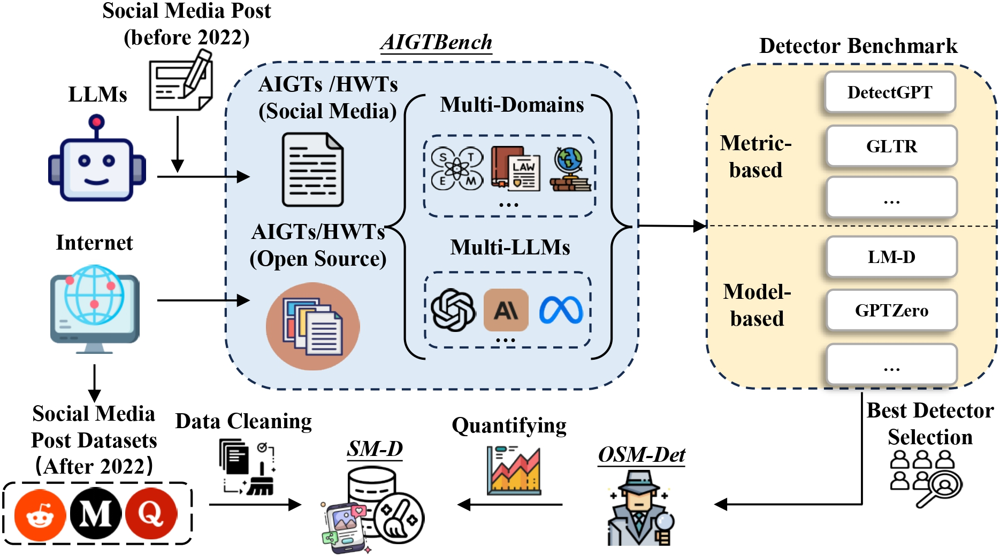

# Are We in the AI-Generated Text World Already? 🤖📱

[](https://arxiv.org/abs/2412.18148)
[](https://huggingface.co/datasets/tarryzhang/AIGTBench)
[](LICENSE)

[ACL2025] Official repository for "[*Are We in the AI-Generated Text World Already? Quantifying and Monitoring AIGT on Social Media*](https://arxiv.org/abs/2412.18148)"

<div align="center">
  
</div>

## 🚀 Quick Start

### Installation

```bash
git clone https://github.com/Vincent-HKUSTGZ/AIGT_on_Social_Media.git
cd AIGT_on_Social_Media

# Create environment
conda create -n aigt python=3.10 -y
conda activate aigt

# Install dependencies
pip install -r requirements.txt
```

### Training OSM-Det

```bash
# Basic training
python train_osm_det.py --model_path allenai/longformer-base-4096

# Custom parameters
python train_osm_det.py \
  --model_path allenai/longformer-base-4096 \
  --num_epochs 10 \
  --batch_size 5 \
  --output_dir ./my_osm_det_model
```

### Evaluation OSM-Det on AIGTBench

```bash
# Evaluate by platform (Medium, Quora, Reddit)
python evaluate_aigtbench.py --model_path ./osm-det-model/final_model

# Custom evaluation
python evaluate_aigtbench.py \
  --model_path ./my_model \
  --batch_size 16 \
  --save_results ./results
```

## 📊 Datasets

### AIGTBench
- **🤗 Hugging Face**: [tarryzhang/AIGTBench](https://huggingface.co/datasets/tarryzhang/AIGTBench)
- **Content**: ~28.77M AIGT + 13.55M human-written samples
- **Platforms**: Medium, Quora, Reddit

### SM-D Dataset
- **Status**: Not publicly available due to ethical considerations
- **Access**: Contact **zsun344@connect.hkust-gz.edu.cn** for research purposes

## 🏆 OSM-Det Checkpoint
- **Download**: [OSM-Det](https://huggingface.co/tarryzhang/OSM-Det)

## 📋 Requirements

- Python 3.10+
- CUDA 11.8+ (for GPU)
- 41GB+ GPU memory (for training)
- 21GB+ GPU memory (for inference)

## 📜 Citation

```bibtex
@inproceedings{SZSZLBZH25,
    title = {{Are We in the AI-Generated Text World Already? Quantifying and Monitoring AIGT on Social Media}},
    author = {Zhen Sun and Zongmin Zhang and Xinyue Shen and Ziyi Zhang and Yule Liu and Michael Backes and Yang Zhang and Xinlei He},
booktitle = {{Annual Meeting of the Association for Computational Linguistics (ACL)}},
    pages = {},
    publisher ={ACL},
    year = {2025}
}
```

## ⚖️ License

Apache 2.0 License
